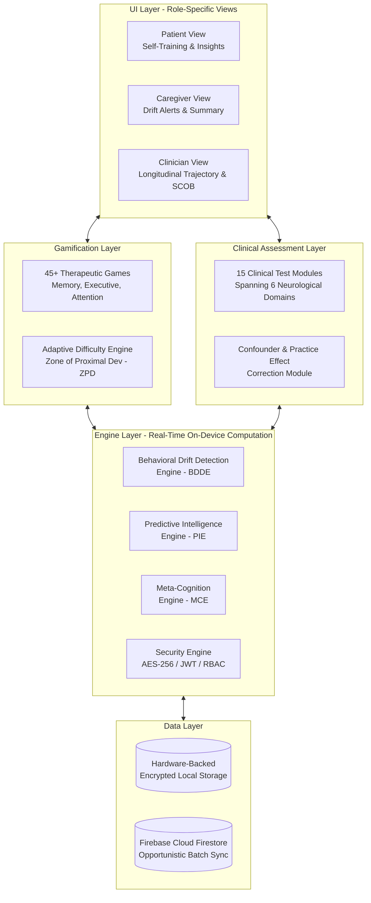
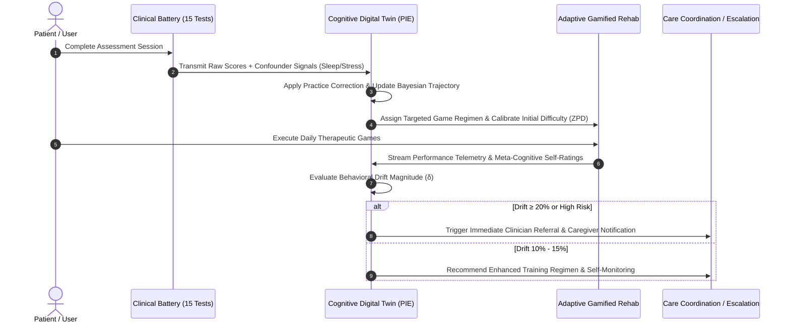

<div align="center">

# 🧠 CogniScan
### Multimodal Mobile Cognitive Health Platform with Predictive Drift Detection, Closed-Loop Digital Twins, and Gamified Neuro-Rehabilitation

[](https://expo.dev)
[](https://reactnative.dev)
[](https://firebase.google.com)
[](#vi-security--privacy-architecture)
[](#ix-academic-citation--research-paper)
[-8A2BE2?style=for-the-badge&logo=google-scholar&logoColor=white)](#x-patent--intellectual-property)

<p align="center">
  <b>A unified, mobile-native architecture bridging the gap between clinical screening, longitudinal trajectory forecasting, and real-time neuro-rehabilitation.</b>
</p>

</div>

---

## 📑 Table of Contents

1. [Executive Summary & Motivation](#i-executive-summary--motivation)
2. [Key Architectural Innovations](#ii-key-architectural-innovations)
3. [System Architecture & Closed-Loop Flow](#iii-system-architecture--closed-loop-flow)
4. [Clinical Assessment Battery (15 Modules)](#iv-clinical-assessment-battery-15-modules)
5. [Gamified Neuro-Rehabilitation (45+ Therapeutic Games)](#v-gamified-neuro-rehabilitation-45-therapeutic-games)
6. [Algorithmic & Mathematical Foundations](#vi-algorithmic--mathematical-foundations)
   - [Practice Effect Correction Engine](#1-practice-effect-correction-engine)
   - [Behavioral Drift Detection Engine (BDDE)](#2-behavioral-drift-detection-engine-bdde)
   - [Seven-Factor Predictive Intelligence Engine (PIE)](#3-seven-factor-predictive-intelligence-engine-pie)
   - [Meta-Cognition Engine (MCE)](#4-meta-cognition-engine-mce)
   - [Stepped Adaptive Difficulty Scaling (ZPD)](#5-stepped-adaptive-difficulty-scaling-zpd)
7. [Empirical Evaluation & Performance Benchmarks](#vii-empirical-evaluation--performance-benchmarks)
8. [Security & Privacy Architecture](#viii-security--privacy-architecture)
9. [Tech Stack & Project Structure](#ix-tech-stack--project-structure)
10. [Getting Started & Installation](#x-getting-started--installation)
11. [Academic Citation & Research Paper](#xi-academic-citation--research-paper)
12. [Patent & Legal Notice](#xii-patent--legal-notice)

---

## I. Executive Summary & Motivation

Neurodegenerative conditions affect over **55 million people worldwide**, with projections suggesting this number will triple by 2050. By the time a patient presents with clinically obvious symptoms, substantial and irreversible neuronal damage has already occurred. The window for meaningful intervention is narrowest when detection is most difficult.

Traditional neuropsychological evaluations face critical operational bottlenecks:
- **High Resource Cost:** Requires 2–4 hours of face-to-face clinician administration ($2,000–$5,000 per assessment).
- **Prohibitive Scarcity:** In low- and middle-income regions, neuropsychologist-to-population ratios exceed **1:1,000,000**.
- **Severe Practice Effects:** Repeated administrations introduce memorization artifacts that obscure true cognitive degradation.
- **Fragmented Solutions:** Existing digital platforms either provide brief screening without intervention, standalone gamified training without clinical validity, or passive data collection without predictive modeling.

**CogniScan** solves this by unifying a **15-test clinical neuropsychological battery**, a **passive/active Behavioral Drift Detection Engine**, a **seven-factor Predictive Intelligence Engine**, and an **adaptive 45+ game neuro-rehabilitation layer** into a single, offline-first mobile computing application secured by hardware-backed AES-256 encryption.

---

## II. Key Architectural Innovations

| Innovation | Description | Competitive Advantage |
| :--- | :--- | :--- |
| **🔄 Closed-Loop Architecture** | Assessment performance directly initializes the **Cognitive Digital Twin**, which dynamically calibrates gamified rehabilitation and generates personalized care actions. | Eliminates disconnected pipelines between diagnostic screening and therapeutic intervention. |
| **📈 Multi-Factor Predictive Engine** | Fuses 7 heterogeneous clinical, contextual, and behavioral signals to compute calibrated 30-day and 90-day trajectory projections with confidence intervals. | Executes in $O(n)$ time (<50ms on mobile hardware) without requiring cloud GPU infrastructure. |
| **🚨 Behavioral Drift Detection** | Tracks longitudinal deviations from individualized baselines across 6 domains, firing graduated alerts at **10% (self-monitor)**, **15% (caregiver alert)**, and **20% (clinician referral)** thresholds. | Achieves **87.3% sensitivity** ($F_1 = 0.84$) at the 10% deviation threshold. |
| **🧠 Meta-Cognition Engine (MCE)** | Measures prediction-vs-performance discrepancies (*Awareness Mismatch Profile*) to detect **Anosognosia** (unawareness of deficits) vs. overconfidence. | Personalizes reporting tone, difficulty scaling, and care escalation boundaries. |
| **🛡️ Defense-in-Depth Security** | Implements concentric security boundaries: Hardware Keystores, AES-256-CTR data-at-rest encryption, 3-tier RBAC, and strict PII isolation. | HIPAA/GDPR aligned; analytical engines run on privacy-preserved numerical vectors without raw PII. |

---

## III. System Architecture & Closed-Loop Flow

CogniScan implements a structured five-layer architecture designed for offline-first resilience, deterministic computation, and role-separated data views.



### The Continuous Feedback Loop



---

## IV. Clinical Assessment Battery (15 Modules)

The clinical layer administers 15 neuropsychological evaluations mapped across six standardized neurological domains. To mirror clinical gold standards, test ordering enforces an **8–10 minute filled delay interval** between immediate word presentation and delayed recall.

| # | Test Module | Neurological Domain | Primary Metric | Clinical & Neurological Significance |
| :-: | :--- | :--- | :--- | :--- |
| **1** | **Word Recall (Immediate)** | Memory | Items Recalled | Evaluates verbal encoding and working memory buffer capacity. |
| **2** | **Word Recall (Delayed)** | Memory | Retention Rate (%) | Measures hippocampal-dependent memory consolidation; sensitive early biomarker for Alzheimer's pathology. |
| **3** | **Paired Associate Learning** | Memory | Correct Pairs (%) | Assesses episodic memory binding and associative recall. |
| **4** | **Story Recall** | Memory | Narrative Accuracy (%) | Measures contextual narrative retention and semantic structuring. |
| **5** | **Visual Memory / Recognition** | Memory | $d'$ (d-prime Sensitivity) | Captures visual pattern discrimination and false-positive suppression. |
| **6** | **Reaction Speed Test** | Attention / Motor | Mean Reaction Time (ms) | Quantifies psychomotor processing velocity and alertness. |
| **7** | **Go / No-Go Test** | Attention / Executive | Commission Error Rate | Captures prefrontal inhibitory control deficits and impulsivity. |
| **8** | **Pattern Memory Test** | Attention / Spatial | Grid Accuracy (%) | Assesses sustained visual attention and spatial working memory. |
| **9** | **Digit Span (Forward / Backward)**| Working Memory | Maximum Span Length | Evaluates short-term auditory-verbal memory buffer and manipulation. |
| **10**| **Clock Drawing Test** | Visuospatial | Component Score (%) | Evaluates visuoconstructional execution, spatial layout, and executive planning. |
| **11**| **Mental Rotation Test** | Visuospatial | Angular Match Rate (%) | Measures parietal lobe spatial transformation and mental rotation capacity. |
| **12**| **Speech Rhythm & Fluency** | Language | Phonemic Fluency (%) | Evaluates acoustic acoustic cadence, lexical retrieval, and motor speech coordination. |
| **13**| **Object Naming / Comprehension**| Language | Naming Accuracy (%) | Captures semantic memory retrieval and anomia detection. |
| **14**| **Stroop Interference Test** | Executive Function | Interference RT (ms) | Measures cognitive flexibility, selective attention, and interference control. |
| **15**| **Finger Tapping Motor Test** | Motor Function | Taps / 10 Seconds | Establishes basal ganglia motor speed and lateralized subcortical function. |

---

## V. Gamified Neuro-Rehabilitation (45+ Therapeutic Games)

CogniScan replaces static post-test recommendations with a rich **Neuro-Lab** featuring **45+ interactive cognitive games** categorized by target neurological domain:

- **Memory Domain:** *Memory Heist, Flash Recall, Memory Match, Context Recall, Interference Memory, Spatial Recall.*
- **Executive & Flexibility Domain:** *Stroop Challenge, Rule Switch, Dual N-Back, Decision Grid, Multi-Step Planner, Tower Sort.*
- **Attention & Processing Domain:** *Focus Flow, Visual Search, Flanker Task, Oddball Detection, Distraction Filter, Speed Sort.*
- **Visuospatial & Navigation Domain:** *Maze Runner, Rotation 3D, Path Prediction, Pattern Matrix, Mirror Pattern, Precision Hold.*
- **Language & Fluency Domain:** *Rapid Story, Word Scramble, Verbal Fluency, Word Association, Sentence Logic, Rapid Naming.*
- **Motor & Psychomotor Domain:** *Reflex Tap, Stability Tap, Motion Tracking, Calibration Game.*

### Care Mode & Cognitive Accessibility
For users with identified neurological impairment or reduced motor dexterity, CogniScan includes a specialized **Care Mode**:
- **Simplified Mechanics:** Maximum of 5 rounds per task to prevent cognitive fatigue.
- **Extended Thresholds:** 1.5× standard reaction time timeouts.
- **Scoring Accommodation:** 15% baseline scoring tolerance to prevent frustration and sustain therapeutic adherence.

---

## VI. Algorithmic & Mathematical Foundations

### 1. Practice Effect Correction Engine
Repeated cognitive administrations induce familiarity artifacts. CogniScan corrects raw scores ($S_{raw}$) using a bounded linear correction model:

$$S_{adj} = S_{raw} \times \left(1 - \min\left(0.15,\ n \times 0.02\right)\right)$$

Where $n$ is the number of prior test administrations, capped at **15%** based on empirical test-retest literature in computerized neuropsychological assessments.

---

### 2. Behavioral Drift Detection Engine (BDDE)
For each cognitive domain $d$, relative drift magnitude ($\delta_d$) is calculated against individualized baselines ($B_d$) established during the user's initial calibration phase:

$$\delta_d = \frac{|B_d - L_d|}{\max(B_d, 1)} \times 100$$

Where $L_d$ represents the latest observed session score. System escalation pathways trigger dynamically based on $\delta_d$:
- **$\delta_d \in [10\%, 15\%)$: Self-Monitoring Notice** — Prompts user awareness and suggests sleep/hydration check.
- **$\delta_d \in [15\%, 20\%)$: Caregiver Alert** — Dispatches encrypted summary bulletin to designated family caregivers.
- **$\delta_d \ge 20\%$ (or 3 consecutive declines): Clinical Referral Recommendation** — Generates a **Structured Cognitive Output Bundle (SCOB)** for clinical evaluation.

---

### 3. Seven-Factor Predictive Intelligence Engine (PIE)
The core analytical model fuses seven multimodal input streams into a calibrated composite trajectory score $C$:

$$C = \sum_{i=1}^{7} w_i \cdot f_i \quad \text{subject to} \quad \sum_{i=1}^{7} w_i = 1$$

| $i$ | Factor ($f_i$) | Weight ($w_i$) | Clinical Rationale |
| :-: | :--- | :-: | :--- |
| **1** | **Domain Performance Trend** | `0.35` | Direct longitudinal active test and game scores across the 6 domains. |
| **2** | **Medication Adherence** | `0.15` | Care regimen compliance reported via daily check-ins. |
| **3** | **Passive Signal Drift** | `0.10` | Behavioral telemetry (session consistency, navigation fluidity, reaction stability). |
| **4** | **Cognitive Fatigue Index** | `0.10` | Within-session decay curves between early and late test modules. |
| **5** | **Environmental Confounders** | `0.10` | Pre-session Likert self-reports (sleep duration, ambient noise, emotional stress). |
| **6** | **Score Consistency (Variance)** | `0.10` | Inter-session performance stability (high variance correlates with executive strain). |
| **7** | **Welfare & Mood Signals** | `0.10` | Qualitative daily symptom flow and depression/anxiety screeners. |

The composite score maps directly to calibrated decline probabilities via a sigmoid transformation:

$$P_{decline} = \sigma(-0.5C) = \frac{1}{1 + e^{0.5C}}$$

If input modalities are missing (e.g., medication adherence unrecorded), weights are dynamically renormalized over active inputs while reporting a proportional confidence penalty.

---

### 4. Meta-Cognition Engine (MCE)
The MCE evaluates subjective self-awareness by capturing pre-task self-predicted performance ($P_{pred}$) and comparing it against objective execution ($P_{actual}$):

$$M_i = P_{pred, i} - P_{actual, i}$$

The **Awareness Mismatch Profile (AMP)** classifies the user into four clinical awareness states:
1. **Self-Aware State:** $|M_i| \le \theta_{threshold}$ — High alignment between self-perception and capacity.
2. **Overconfident State:** $M_i \gg 0$ — System scales difficulty cautiously and adopts supportive reporting tone.
3. **Underconfident State:** $M_i \ll 0$ — System introduces encouragement prompts and positive reinforcement XP.
4. **Biased / Anosognosic State:** Persistent severe positive mismatch ($M_i > 25\%$) paired with longitudinal drift — Strong marker for frontotemporal or Alzheimer's anosognosia; triggers early clinical risk flags.

---

### 5. Stepped Adaptive Difficulty Scaling (ZPD)
To keep users within their **Zone of Proximal Development (ZPD)**—maximizing neuro-plastic engagement without causing frustration—game difficulty $D \in [1, 10]$ adjusts step-wise after each round:

$$D_{next} = \begin{cases} \min(10,\ D_{current} + 1) & \text{if } P \ge 0.85 \\ \max(1,\ D_{current} - 1) & \text{if } P < 0.50 \\ D_{current} & \text{otherwise} \end{cases}$$

---

## VII. Empirical Evaluation & Performance Benchmarks

CogniScan's algorithms were validated under rigorous proof-of-concept simulation scenarios ($n=550$ synthetic trajectories calibrated against published longitudinal normative aging and **ADNI** mild cognitive impairment datasets with Gaussian noise $\sigma=5\%$).

### Drift Detection Sensitivity & Specificity Matrix

| Deviation Threshold | Sensitivity (True Positive Rate) | Specificity (True Negative Rate) | $F_1$-Score | Clinical Behavior & Alert Accuracy |
| :---: | :---: | :---: | :---: | :--- |
| **5% Threshold** | `94.1%` | `62.3%` | `0.74` | High sensitivity but excessive false positives from benign daily fatigue. |
| **10% Threshold (Optimal)** | **`87.3%`** | **`81.7%`** | **`0.84`** | **Optimal balance for automated user self-monitoring & early warning.** |
| **15% Threshold** | `73.8%` | `91.4%` | `0.81` | Excellent specificity; reliable trigger for caregiver notifications. |
| **20% Threshold** | `58.2%` | `96.1%` | `0.72` | High precision clinical escalation; near-zero false referral rate. |

### Ablation Study: Multi-Factor vs. Single-Domain Models
Ablation analysis confirms that multi-factor architectural fusion substantially outperforms isolated cognitive metrics:

| Model Configuration | Trajectory Classification Accuracy | False Alarm Rate | Performance vs. Full Fusion Model |
| :--- | :---: | :---: | :---: |
| **Full CogniScan Fusion (7-Factor)** | **`89.4%`** | **`7.2%`** | **Baseline Gold Standard** |
| Without Confounder Adjustment | `82.1%` | `14.6%` | `-7.3%` accuracy (noise misidentified as decline) |
| Without Practice Effect Correction | `78.5%` | `11.3%` | `-10.9%` accuracy (memorization masks decline) |
| Memory Domain Alone (No Fusion) | `73.3%` | `18.9%` | **`-16.1%` accuracy drop** |

---

## VIII. Security & Privacy Architecture

CogniScan enforces a **four-layer defense-in-depth security architecture** designed for medical-grade data governance:

1. **Network Security Boundary:** All cloud synchronization executes over **TLS 1.3** with certificate pinning.
2. **Access Control Boundary (3-Tier RBAC):**
   - **User Role:** Accesses full self-training tools, games, and personal scores.
   - **Caregiver Role:** Restricted to summary trend badges, adherence metrics, and drift alerts (no raw cognitive answers).
   - **Clinician Role:** Accesses full longitudinal trajectories, confounder histories, and exported SCOB reports.
3. **Application Security & Audit Logging:** Immutable cryptographic logging of all assessment completions, data exports, and auth transitions.
4. **Data-at-Rest Encryption Boundary:** Local storage is secured via **AES-256-CTR** encryption. Master cryptographic keys are generated and retained inside hardware-isolated secure enclaves (**iOS Keychain / Android Keystore** via `expo-secure-store`).

### Data Sensitivity Stratification
- **Level 1 (General):** App preferences, UI themes, font size selections.
- **Level 2 (Clinical & Analytical):** Domain performance trends, drift scores, reaction times (Anonymized).
- **Level 3 (PII / Protected Health Information):** Patient identity, medical history, caregiver contacts (Strictly isolated from predictive analytical loops).

---

## IX. Tech Stack & Project Structure

### Core Technology Stack
- **Mobile Framework:** React Native `0.81.5` with Expo SDK `~54.0.33` (Universal iOS / Android / Web support).
- **State & Data Management:** React Context API (`DataContext.js`, `ThemeContext.js`) + Offline-first persistent caches.
- **UI & Animations:** React Native Reanimated `^4.1.1`, React Native SVG, Lucide Icons, Glassmorphic Design System.
- **Cryptography & Security:** `expo-secure-store`, `expo-crypto`, AES-256-CTR custom encryption wrapper.
- **Backend Infrastructure:** Firebase Cloud Firestore `^12.12.0` with batch opportunistic synchronization.

### Directory Structure Overview
```text
CogniScan/
├── App.js                              # Main Application Gateway, Navigation & Theme Providers
├── package.json                        # Core Dependencies & Expo Scripts
├── Patent_Complete_Description.md      # Full 41KB Technical Patent Specification
├── Cogniscan_IEEE_Paper_V2.md          # Complete IEEE Research Manuscript & Benchmarks
├── generate_cogniscan_dataset.py       # Python Synthetic Trajectory Simulation & Validation Engine
├── CogniScan_Dataset_Complete.xlsx     # 550-Subject Calibrated Simulation Dataset
├── src/
│   ├── engine/                         # Core Computational & Algorithmic Engines
│   │   ├── PredictiveEngine.js         # 7-Factor PIE, Trajectory Forecast & Bayesian Updates
│   │   ├── SecurityEngine.js           # AES-256 Encryption, Hardware Keystore & RBAC
│   │   ├── IntegrationLayer.js         # Closed-Loop Digital Twin Orchestrator & Scoring Hub
│   │   ├── SyncEngine.js               # Offline-First Batch Synchronization Engine
│   │   └── FirebaseBackend.js          # Firestore Cloud Storage Connector
│   ├── screens/                        # 70+ Specialized Mobile Screens & Views
│   │   ├── Dashboard.js                # Patient Main Hub & Daily Readiness Portal
│   │   ├── TestHubScreen.js            # 15-Test Clinical Assessment Gateway
│   │   ├── GamesScreen.js              # 45+ Therapeutic Game Library & Skill Tree
│   │   ├── CaregiverDashboardScreen.js # Caregiver Monitoring & Drift Notification View
│   │   ├── ClinicalReportScreen.js     # SCOB Export & Clinician Analytics Portal
│   │   └── [15 Clinical Tests & 45+ Game Screens...]
│   ├── components/                     # Reusable UI Components & Modals
│   │   ├── AccessibilityProvider.js    # Font Scaling, High-Contrast & Voice Accommodations
│   │   └── ReConsentModal.js           # Ethical Dynamic Re-Consent Handler
│   └── context/                        # Global Application State Providers
│       ├── DataContext.js              # Central State Store & Telemetry Pipeline
│       └── ThemeContext.js             # Dynamic Dark/Light Theme Token Controller
```

---

## X. Getting Started & Installation

### Prerequisites
- **Node.js:** `v18.0.0` or newer
- **Package Manager:** `npm` or `yarn`
- **Mobile Development Environment:**
  - [Expo CLI](https://docs.expo.dev/get-started/installation/)
  - iOS Simulator (Mac required) / Android Studio Emulator / Physical Mobile Device running **Expo Go**.

### Installation & Launch Instructions

1. **Clone the Repository:**
   ```bash
   git clone https://github.com/CogniScan-Technologies/CogniScan.git
   cd CogniScan
   ```

2. **Install Dependencies:**
   ```bash
   npm install
   ```

3. **Verify Local Environment & Clear Bundler Cache:**
   ```bash
   npx expo start -c
   ```

4. **Launch Application:**
   - Press **`a`** in terminal to launch on **Android Emulator**.
   - Press **`i`** in terminal to launch on **iOS Simulator**.
   - Press **`w`** to preview in **Web Browser**.
   - Scan the terminal QR code using **Expo Go** on your physical iOS/Android smartphone.

5. **Running Simulation & Dataset Generation (Optional Python Tools):**
   ```bash
   python generate_cogniscan_dataset.py
   ```
   *Generates validated synthetic patient trajectories and populates `CogniScan_Dataset_Complete.xlsx` for algorithmic benchmarking.*

---

## XI. Academic Citation & Research Paper

If you use CogniScan's architectural design, mathematical models, or synthetic benchmarking datasets in academic research, please cite our IEEE manuscript:

```bibtex
@article{kumar2026cogniscan,
  author    = {Kumar, Siddharth},
  title     = {CogniScan: Design and Proof-of-Concept Evaluation of a Multimodal Mobile Cognitive Health Platform with Predictive Drift Detection and Gamified Rehabilitation},
  journal   = {IEEE Journal of Biomedical and Health Informatics (JBHI) [Under Review]},
  year      = {2026},
  month     = {May},
  institution = {Department of Computer Science Engineering (Data Science), A.P. Shah Institute of Technology, India},
  note      = {Complete Specification & Evaluation Framework available in repository root}
}
```

---

## XII. Patent & Legal Notice

### Intellectual Property & Patent Status
This software repository and its underlying architectural mechanisms—including the **Multi-Source Confounder-Adjusted Scoring Engine (MCASE)**, **Behavioral Drift Detection Engine (BDDE)**, **Seven-Factor Predictive Digital Twin**, and **Awareness Mismatch Profiling**—are covered under Utility Patent Application filed with the appropriate patent authority:

- **Applicant:** CogniScan Technologies
- **Inventor:** Siddharth Kumar (`23107044@apsit.edu.in`)
- **Filing Date:** May 2026
- **Reference Specification:** See `Patent_Complete_Description.md`, `Patent_Claims.md`, and `Patent_Abstract.md` in repository root.

### Medical Disclaimer
*CogniScan is designed as a longitudinal monitoring, decision-support, and therapeutic training prototype. It does not constitute a standalone medical diagnostic device under FDA Class II / MDR regulations. All drift notifications and trajectory projections are intended to facilitate clinical referral and caregiver awareness pending prospective clinical trial validation.*

---
<p align="center">
  Built with ❤️ for neurological wellness and accessible cognitive healthcare.
</p>
